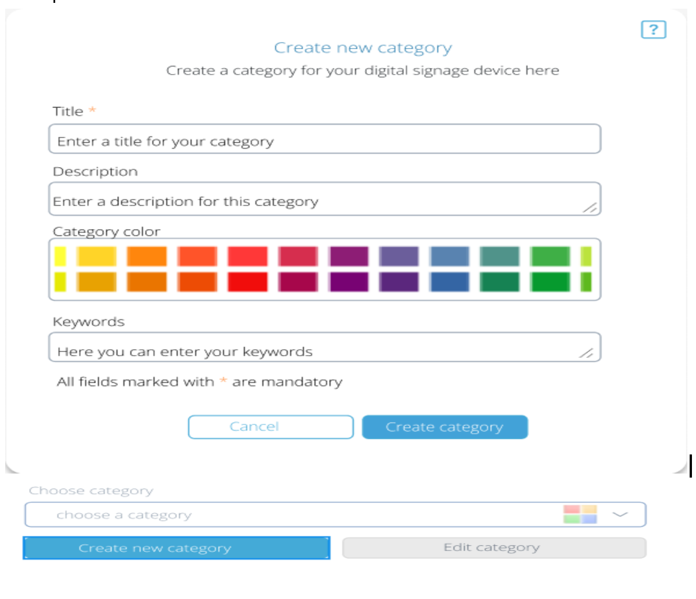
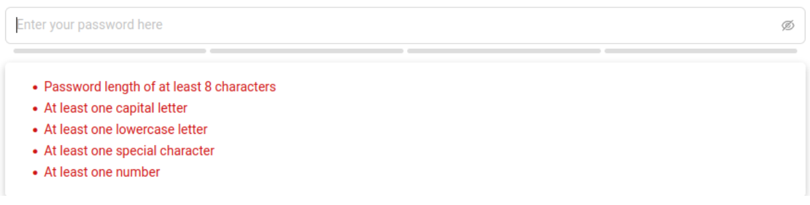
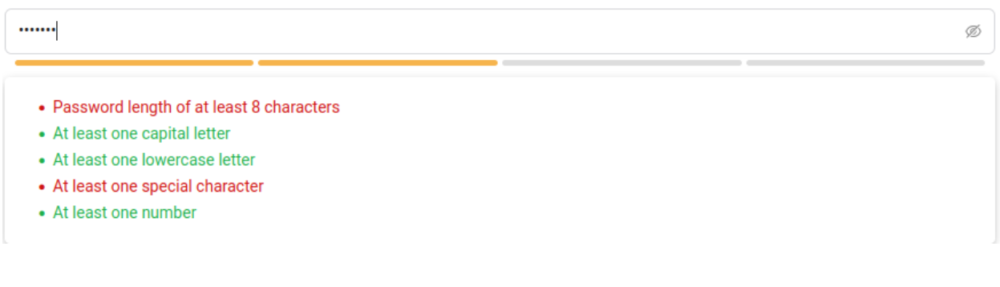

# Getting Started with Create React App

This project was bootstrapped with [Create React App](https://github.com/facebook/create-react-app).

## Available Scripts

In the project directory, you can run:

### `npm start`

Runs the app in the development mode.\
Open [http://localhost:3000](http://localhost:3000) to view it in the browser.

The page will reload if you make edits.\
You will also see any lint errors in the console.

### `npm test`

Launches the test runner in the interactive watch mode.\
See the section about [running tests](https://facebook.github.io/create-react-app/docs/running-tests) for more information.

### `npm run build`

Builds the app for production to the `build` folder.\
It correctly bundles React in production mode and optimizes the build for the best performance.

The build is minified and the filenames include the hashes.\
Your app is ready to be deployed!

See the section about [deployment](https://facebook.github.io/create-react-app/docs/deployment) for more information.

### `npm run eject`

**Note: this is a one-way operation. Once you `eject`, you can’t go back!**

If you aren’t satisfied with the build tool and configuration choices, you can `eject` at any time. This command will remove the single build dependency from your project.

Instead, it will copy all the configuration files and the transitive dependencies (webpack, Babel, ESLint, etc) right into your project so you have full control over them. All of the commands except `eject` will still work, but they will point to the copied scripts so you can tweak them. At this point you’re on your own.

You don’t have to ever use `eject`. The curated feature set is suitable for small and middle deployments, and you shouldn’t feel obligated to use this feature. However we understand that this tool wouldn’t be useful if you couldn’t customize it when you are ready for it.

## Learn More

###Part 2:
-category selection page:
A category selection page with the following parameters
1- category name with description and keyword
2- category selection drop down menu, must include :
2_1 - category name
2_2 - categories assigned color
3- buttons for submitting, adding and editing a category
A new category has a name, description and keyword field plus preselected colors with the option to customize using a color wheel.
Add category and edit category buttons will open a modal.
Added and changed categories will be displayed on the dropdown menu
examples:

---

-signup and login
A sign up and login page, sign up requires a username, email field and password.

A password field that requires the following parameters :
At least 8 characters
At least one capital letter
At least one lower case letter
At least one special character
At least one number
Password strength meter

A drop menu must be present, showing the status of the parameters e.g:

As parameters are set, the menu will change the status of the parameters e.g:

Signup will only require a username and password.

Login should only be possible with the newly made accounts and a default admin account with the following username and password:
Username : Admin
Password : Admin
